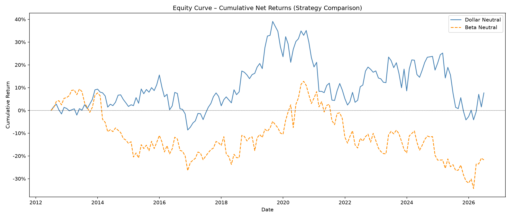
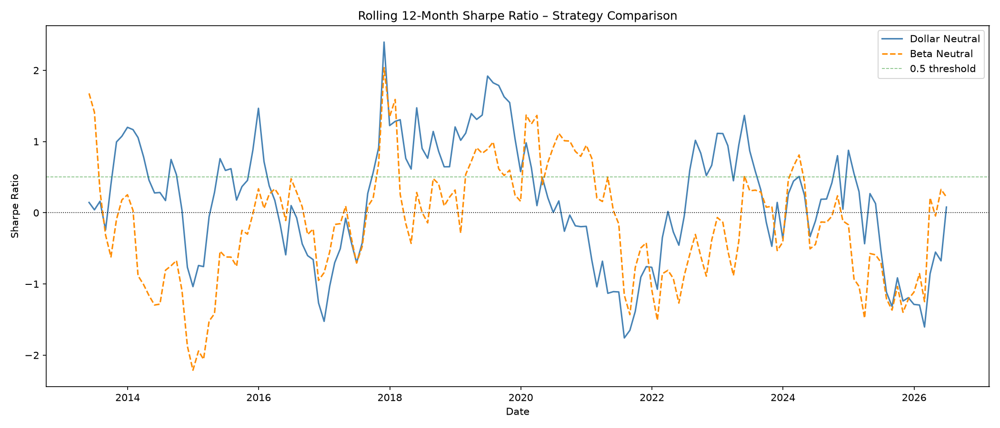
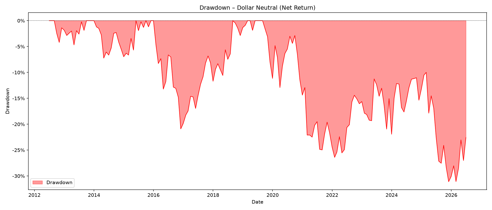
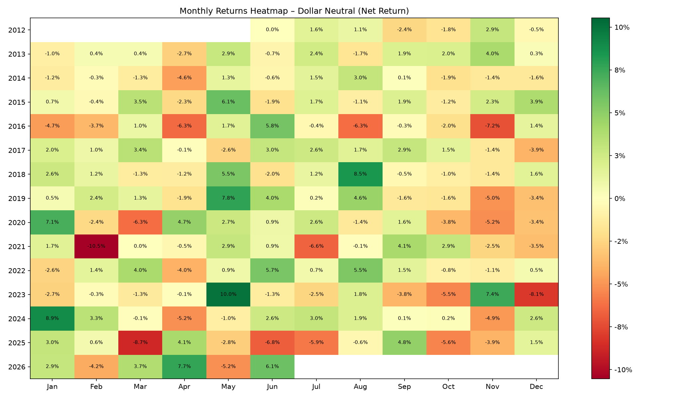

# Market-Neutral Equity Factor Strategy

A quantitative equity research project implementing a market-neutral long/short factor strategy in Python. Built to demonstrate cross-sectional signal construction, portfolio construction, realistic backtesting, and regime-aware performance evaluation — using S&P 500 constituent data.

---

## Motivation

The FX Options project answered a single instrument question: how do you price, hedge, and risk-manage one derivative under uncertain volatility? This project asks a different one, at portfolio scale, across an entire equity universe, which cross-sectional signals actually generate risk-adjusted returns, and do they survive real-world frictions like transaction costs and regime shifts?

My background so far has been mostly bottom-up: one company, one deal, one model at a time. Now let us take a look towards the other side of that coin: systematic, cross-sectional analysis across hundreds of names at once.

This project builds a full pipeline: pulling the S&P 500 universe, constructing momentum and mean reversion signals, forming dollar-neutral and beta-neutral portfolios, and backtesting both with transaction costs, drawdown analysis, and regime splits. Where the FX project asked what happens when Black-Scholes' assumptions break, this one asks what happens when a factor's edge meets turnover costs and a bear market.

---

## What This Project Covers

**Data**
- Full S&P 500 constituent list scraped from Wikipedia, with local CSV fallback
- 15 years of daily adjusted close prices via yfinance, downloaded in batches
- Tickers with excessive missing data dropped; survivorship bias explicitly documented as a limitation

**Signals**
- Momentum (Jegadeesh & Titman, 1993): 12-month return, most recent month excluded to avoid reversal contamination
- Short-Term Mean Reversion (Jegadeesh, 1990; De Bondt & Thaler, 1985): inverted 1-month return
- 50/50 composite score combining both signals (Balvers & Wu, 2006)

**Portfolio Construction**
- Dollar-neutral long/short: top/bottom decile, equal-weighted, gross exposure 2.0
- Beta-neutral variant: short side rescaled so long and short beta-exposure exactly offset (Grinold & Kahn, 2000)




**Backtesting**
- Monthly rebalancing with a one-period lag to avoid look-ahead bias
- Turnover-based transaction costs (10bps one-way), long and short sides tracked separately

**Performance**
- Annualised return, volatility, Sharpe ratio (Sharpe, 1994), Calmar ratio, max drawdown, hit rate
- Bull/Bear regime split and named crisis-period analysis — GFC 2008, COVID 2020, 2022 Rate Hikes (Daniel & Moskowitz, 2016)




---

## Project Structure

```
├── main.py                     # Full pipeline: data → signals → portfolio → backtest → performance
│
├── data/
│   ├── loader.py                # S&P 500 price data via yfinance, cached as Parquet
│   └── universe.py              # S&P 500 constituent list (Wikipedia, CSV fallback)
├── signals/
│   ├── momentum.py               # Jegadeesh-Titman momentum signal
│   └── mean_reversion.py         # Short-term reversal signal
├── portfolio/
│   ├── construction.py           # Composite signal, dollar-neutral weights
│   └── beta.py                   # Rolling beta, beta-neutral weights
├── backtest/
│   └── engine.py                 # Monthly backtest with transaction costs
└── performance/
    ├── metrics.py                 # Sharpe, Calmar, drawdown, hit rate
    ├── regime.py                  # Bull/Bear and crisis-period analysis
    └── visualisation.py           # Equity curve, drawdown, heatmap, rolling Sharpe
```

---

## Getting Started

**Install dependencies:**
```bash
pip install -r requirements.txt
```

**Run the full pipeline:**
```bash
python main.py
```

---

## Key Results

- Dollar Neutral Sharpe (net): 0.04 | Beta Neutral Sharpe (net): -0.12
- Beta-neutral hedging reduces average portfolio beta from 0.64 (Dollar Neutral) to 0.000000 (exactly hedged), but destroys momentum alpha via the short-side rescaling, turning net Sharpe negative
- Regime-dependent performance: positive Sharpe in Bull months (0.08), negative in Bear months (-0.04): dollar neutrality does not by itself protect against drawdowns
- Crisis periods are mixed: +11.62% total return through the 2022 Rate Hikes period, -1.59% through COVID 2020; GFC 2008 falls outside the current 15-year data window and is excluded

## References

- Jegadeesh, N. & Titman, S. (1993). *Returns to Buying Winners and Selling Losers: Implications for Stock Market Efficiency.* Journal of Finance, 48(1), 65–91.
- Jegadeesh, N. (1990). *Evidence of Predictable Behavior of Security Returns.* Journal of Finance, 45(3), 881–898.
- De Bondt, W.F.M. & Thaler, R. (1985). *Does the Stock Market Overreact?* Journal of Finance, 40(3), 793–805.
- Balvers, R. & Wu, Y. (2006). *Momentum and Mean Reversion Across National Equity Markets.* Journal of Empirical Finance, 13(1), 24–48.
- Grinold, R. & Kahn, R. (2000). *Active Portfolio Management.* McGraw-Hill, 2nd Edition.
- Sharpe, W.F. (1994). *The Sharpe Ratio.* Journal of Portfolio Management, 21(1), 49–58.
- Daniel, K. & Moskowitz, T. (2016). *Momentum Crashes.* Journal of Financial Economics, 122(2), 221–247.